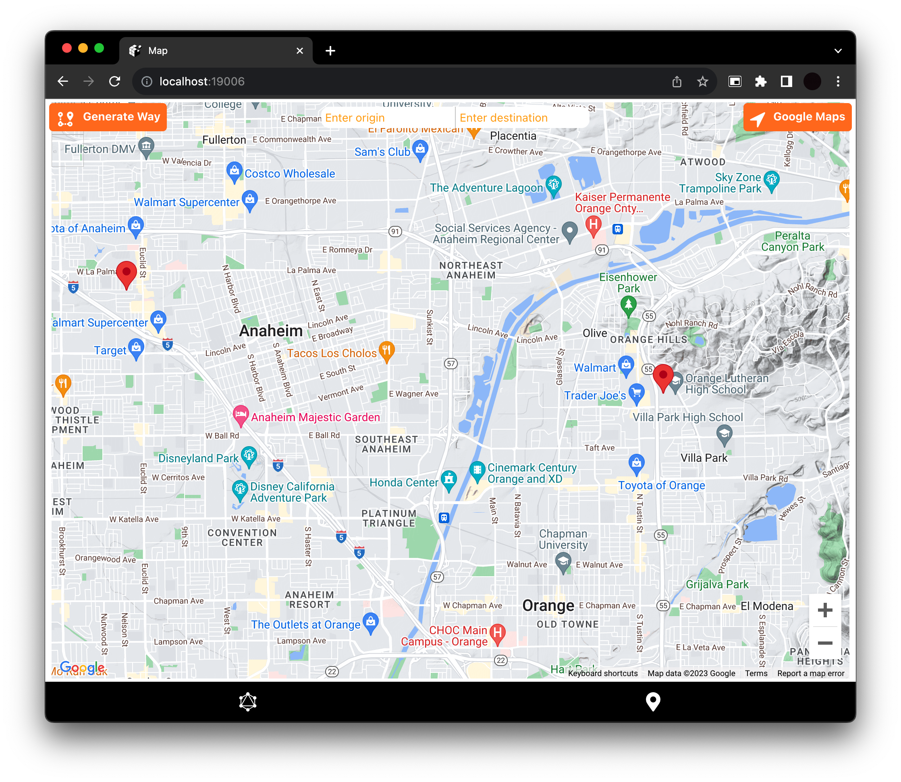
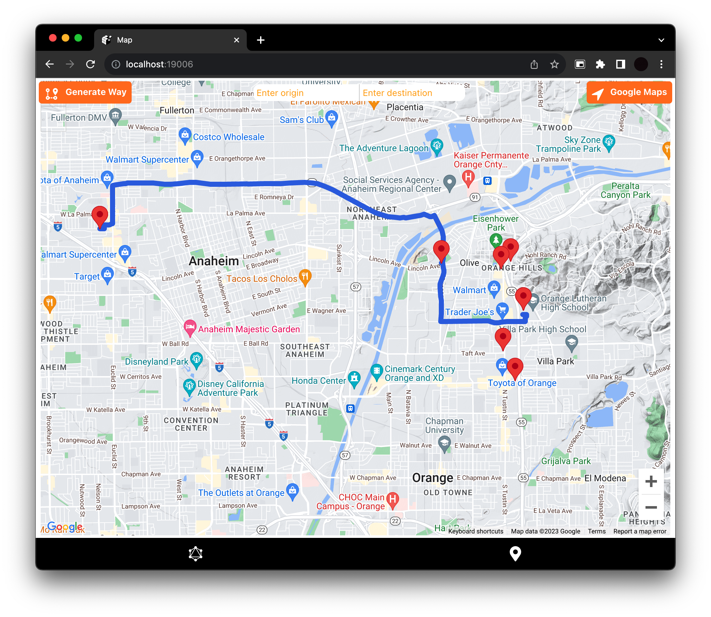
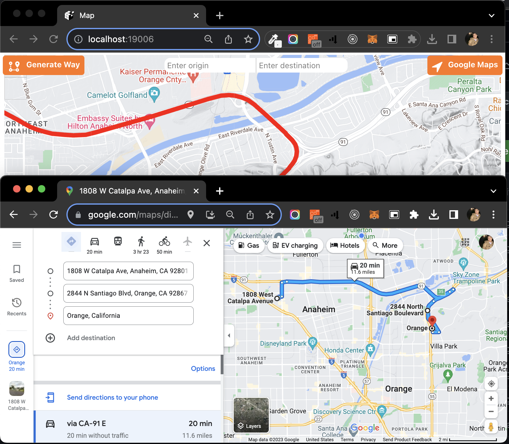
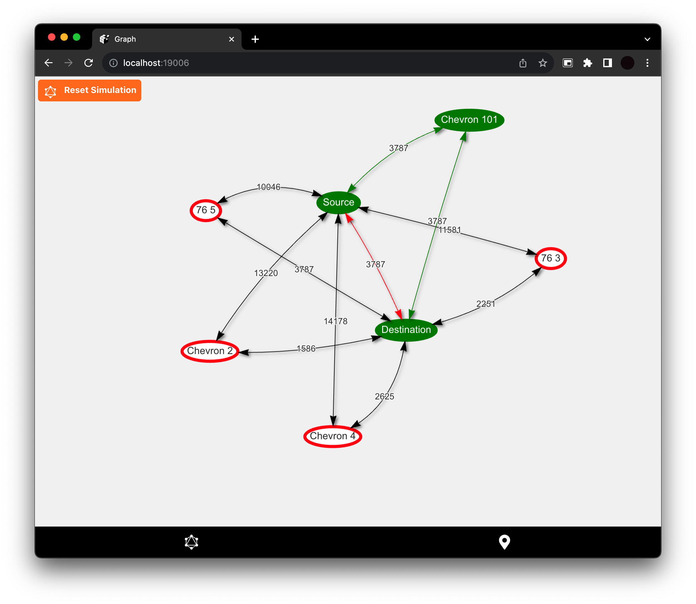
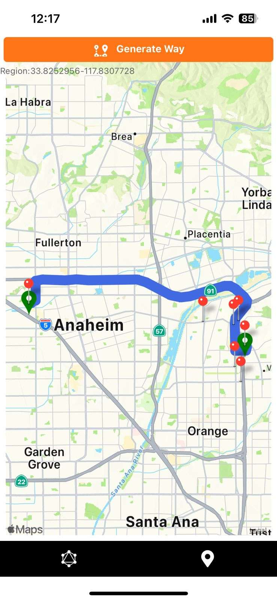

# Civic Guardian
City Navigation and Emergency Route Planning Tool

## Description

In this project we had implemented intrusive UI components to power rather a customised Floyd-Warshall algorithmeic implementation derived with help of Google APIs. This application is developed with a utilitarian view of the research areas around Floyd Warshall in scenario of  real world navigation. The features this application supports to be able to run in different platforms and to integrate with native maps of any platform will definitely be of a great benefit to the end user. The graph screen shows the rationale involved in optimising the google maps routes API adding more power to the existing maps to avoid end user decision fatigue by selecting the best possible route and weights leading to such a resolution. At the end this project is a fine product which depicts a powerful use case of Floyd-Warshall in real world navigation by optimising Google Maps.


## To Run
```bash
docker-compose up 
```

[Link to documentation - API](https://documenter.getpostman.com/view/12122001/2s9YJc23n7)
[Youtube Video link](https://youtu.be/7vQs4laBbP8)

# Screenshots of UI

Landing Page:

Map Screen:




Graph Screen:


Mobile Visuals:
.jpg)
.jpg)
.jpg)


# Contributions

Welcome :)
